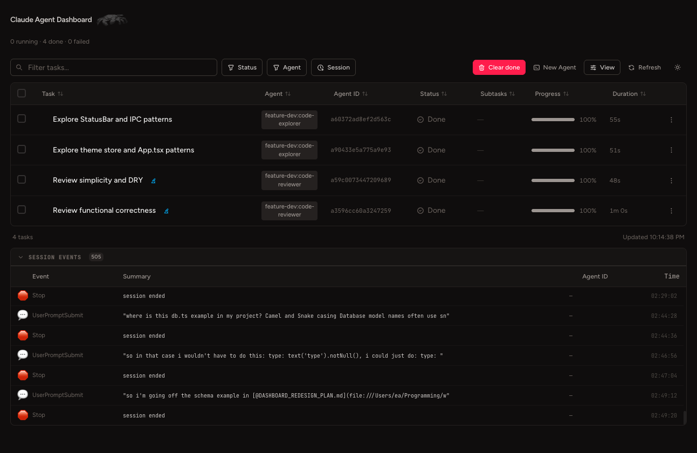

# Claude Agent Dashboard


A real-time observability dashboard for [Claude Code](https://claude.ai/code) agent sessions.
When Claude Code dispatches subagents, this dashboard tracks every task as it runs — status,
duration, logs, parent-child relationships, and the full session event trail — all updated live
via a hook-driven pipeline.



---

## What It Does

Claude Code exposes a hook system that fires shell scripts at key lifecycle moments
(tool calls starting/finishing, session start/stop, permission requests, etc.). This dashboard
wires into all 18 of those event types and displays the resulting data in real time.

- **Task table** — every `Agent` tool call becomes a row: name, agent type, agent ID, status
  badge, subtask count, progress bar, and elapsed duration
- **Parent-child tree** — subagents are nested under the task that spawned them; the tree
  is reconstructed client-side from `parentId` on every poll
- **Session events panel** — live stream of Claude Code lifecycle events
  (`UserPromptSubmit`, `SessionStart`, `PermissionRequest`, `PreCompact`, etc.) with
  timestamps and summaries
- **Dependency tracking** — tasks can declare `[dependsOn:ID1,ID2]` in their description;
  the dashboard computes and displays `blocked` state when dependencies are unfinished
- **Skill attribution** — when a session starts with a `/skill-name` command, every task
  spawned in that session is tagged with the originating skill
- **Dark / light mode** — full stone palette inversion via Tailwind v4 CSS variables;
  no flash on toggle

---

## Tech Stack

| Layer | Technology |
|---|---|
| Frontend | React 19 + TypeScript + Tailwind v4 (CSS-first `@theme {}`) |
| API | [Hono](https://hono.dev/) REST server with typed handlers |
| Database | SQLite via [Drizzle ORM](https://orm.drizzle.team/) (snake_case schema) |
| Runtime | [Bun](https://bun.sh/) (server, scripts, package manager) |
| Build | Vite 6 with `vite-tsconfig-paths` for `@/` aliases |
| Hooks | Bash scripts reading stdin JSON from Claude Code's hook runner |

---

## How It Works

```
Claude Code Agent
  → Hook scripts (pre-tool-agent.sh, post-tool-agent.sh, session-event.sh, …)
  → POST/PATCH /api/tasks and /api/sessionEvents   (Hono REST, port 3001)
  → SQLite database  (data/dashboard.db)
  → React polls /api/tasks every 2.5s  (port 5173)
  → TaskTable renders task tree + session events
```

Hook scripts are registered globally in `~/.claude/settings.json` so the dashboard monitors
all Claude Code sessions, not just sessions inside this repo.

---

## Running Locally

**Prerequisites**: [Bun](https://bun.sh/) and [Claude Code](https://claude.ai/code) installed.

```bash
# 1. Clone and install
git clone https://github.com/ethaneagle/claude-agent-dashboard
cd claude-agent-dashboard
bun install

# 2. Initialize the SQLite database
bunx drizzle-kit push

# 3. Register the hooks globally (one-time setup)
#    Add the contents of docs/HOOK.md to ~/.claude/settings.json

# 4. Start all services
bun run dev
# → Vite UI at http://localhost:5173
# → Hono API at http://localhost:3001
# → Hook log stream in the terminal
```

Once running, open `http://localhost:5173`. Start any Claude Code session in another terminal
and tasks will appear in the dashboard as agents are dispatched.

---

## Project Structure

```
src/
  server.ts              # Hono REST API (tasks, sessionEvents, sessions)
  db/
    schema.ts            # Drizzle schema (tasks, logs, session_events, …)
    index.ts             # Drizzle client + WAL pragmas
  components/
    TaskTable.tsx        # Main table (toolbar, tree rows, log detail, actions)
    GlobalEventStrip.tsx # Session events panel
    Dashboard.tsx        # Root component — polling state, theme toggle
  hooks/
    useTaskPolling.ts    # 2.5s poll + client-side tree builder + blocked state
  types/
    task.ts              # Task, TaskNode, HookEvent, SessionEvent types
scripts/
  pre-tool-agent.sh      # PreToolUse hook — creates task via POST /tasks
  post-tool-agent.sh     # PostToolUse hook — updates task via PATCH /tasks/:id
  pre-tool-all.sh        # PreToolUse (all tools) — appends HookEvent to task
  post-tool-all.sh       # PostToolUse (all tools) — marks HookEvent complete/failed
  session-event.sh       # Session lifecycle hook — POSTs to /sessionEvents
docs/
  FOR_ETHAN.md           # Architecture log, design decisions, bug post-mortems
  IMPLEMENTATION.md      # Phase-by-phase build history + open TODOs
```
